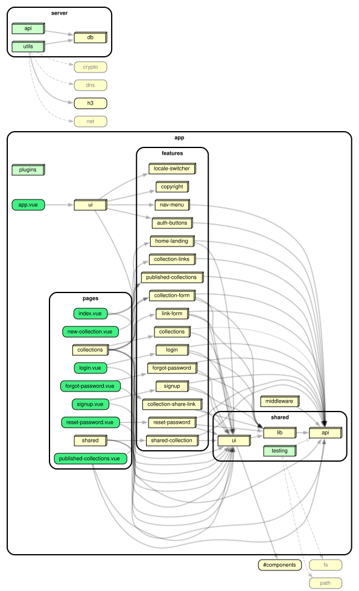

# Linkfolio

Linkfolio is a Nuxt app for building collections of links and sharing them via a public slug — optionally password-protected — with automatic link-preview scraping.

## Tech stack

- [Nuxt 4](https://nuxt.com) / Vue 3, TypeScript
- [Vuetify](https://vuetifyjs.com) (via `vuetify-nuxt-module`) — UI
- [Neon](https://neon.tech) Serverless Postgres + [Drizzle ORM](https://orm.drizzle.team) — database
- [Better Auth](https://better-auth.com) (`better-auth/vue`), proxied to Neon Auth — authentication
- [Vercel Blob](https://vercel.com/docs/storage/vercel-blob) — image upload storage; [Cloudinary](https://cloudinary.com) via `@nuxt/image` — image delivery/transforms
- [`@nuxtjs/i18n`](https://i18n.nuxtjs.org) — English/Russian
- [`@sentry/nuxt`](https://docs.sentry.io/platforms/javascript/guides/nuxt/) — error monitoring
- Vitest + `@nuxt/test-utils` — unit testing
- [Playwright](https://playwright.dev) — end-to-end testing
- [Storybook](https://storybook.js.org) + [Chromatic](https://www.chromatic.com) — component development, visual testing
- ESLint + Prettier + Husky/lint-staged — linting, formatting, pre-commit hooks
- [dependency-cruiser](https://github.com/sverweij/dependency-cruiser) — circular-import and app/server boundary checks, dependency graph visualization

## Prerequisites

- Node version pinned in [`.nvmrc`](./.nvmrc) — run `nvm use`
- [pnpm](https://pnpm.io) (see `pnpm-lock.yaml`)
- A [Neon](https://neon.tech) account/project (for Postgres + Neon Auth)

## Setup

1. Install dependencies:

   ```bash
   pnpm install
   ```

2. Set up environment variables. Either copy `.env.example` to `.env` and fill in the values from the Neon console, or, if the project is already linked (see `.neon`), pull them automatically:

   ```bash
   npx neon env pull
   ```

   | Variable                | Purpose                                                         |
   | ----------------------- | --------------------------------------------------------------- |
   | `DATABASE_URL`          | Pooled Postgres connection, used by the app at runtime          |
   | `DATABASE_URL_UNPOOLED` | Direct Postgres connection, used for Drizzle migrations         |
   | `NEON_BRANCH`           | Linked Neon branch name                                         |
   | `NEON_AUTH_BASE_URL`    | Neon Auth backend URL, proxied by `server/api/auth/[...all].ts` |
   | `NEON_AUTH_JWKS_URL`    | Neon Auth JWKS endpoint                                         |
   | `BETTER_AUTH_API_KEY`   | Neon Auth API key                                               |
   | `BLOB_READ_WRITE_TOKEN` | Vercel Blob token for image uploads (Vercel dashboard → Storage → Blob store, or `vercel env pull`) |

   These values are project secrets — never expose them to client-side code.

   Running the Playwright e2e suite needs extra env in `.env.e2e.local` (gitignored, layered on top of `.env`):

   | Variable                     | Purpose                                                                          |
   | ----------------------------- | --------------------------------------------------------------------------------- |
   | `NEON_API_KEY`                | Neon API key, used to call the branch-restore API                                |
   | `NEON_TEST_BRANCH_ID`         | Persistent `e2e-test` Neon branch the tests run against                          |
   | `NEON_RESET_SOURCE_BRANCH_ID` | Schema-only `e2e-base` branch `e2e-test` is restored from before/after each run  |
   | `TEST_DATABASE_URL`           | Connection string for `e2e-test`, used as the app's `DATABASE_URL` under Playwright |

   Regular `.env` (`DATABASE_URL`, `NEON_AUTH_*`, `BETTER_AUTH_API_KEY`) is still needed too — `password-reset.spec.ts` reads the reset token straight from prod's `neon_auth.verification`. Neon Auth is project-scoped, not per-branch, so e2e signups also land real rows in prod's `neon_auth.user`; run `pnpm cleanup:e2e-users` periodically to clean these up (dry-run by default, append `-- --yes` to actually delete).

3. Run database migrations:

   ```bash
   pnpm db:migrate
   ```

   (`pnpm db:generate` regenerates migration files after changing `server/db/schema.ts`.)

4. (Optional) Sentry source map uploads. `pnpm build` uploads source maps via `@sentry/nuxt`'s build plugin, which needs an auth token separate from `.env`. Copy `.env.sentry-build-plugin.example` to `.env.sentry-build-plugin` and set `SENTRY_AUTH_TOKEN` (from Sentry → org "home-nbh" → project "linkfolio"). Not required for `pnpm dev`.

## Development server

Start the development server on `http://localhost:3000`:

```bash
pnpm dev
```

## Testing

```bash
pnpm test            # or test:coverage — CI's gate, enforces coverage floor
pnpm spec-ratchet     # every model/server-utils/api file has a colocated test
```

### End-to-end (Playwright)

```bash
pnpm exec playwright install   # first time only, installs browsers
pnpm test:e2e                  # runs e2e/*.spec.ts against local dev server
```

Single worker, not parallel — spec files share one dev server and one Neon Auth backend/test branch. Runs in CI on every PR and push to `main` (`.github/workflows/e2e.yml`), uploading a report artifact on failure.

## Linting, formatting, type-checking

```bash
pnpm lint        # or lint:fix
pnpm format      # or format:fix
pnpm type-check
```

## Dependency graph

```bash
pnpm dep-check        # CI gate: no circular imports, no app/**<->server/** imports
pnpm dep-graph         # prints a Mermaid diagram to stdout — paste into a PR/Markdown
pnpm dep-graph:archi   # renders dependency-graph.svg (needs Graphviz's `dot` locally)
```

Requires Node `^22||^24||>=26` (dependency-cruiser's own supported range) — the project's pinned version ([`.nvmrc`](./.nvmrc), `v26.7.0`) already satisfies this, so `nvm use` (see Prerequisites) is enough if your default Node is outside that range. See `.dependency-cruiser.cjs` and `CLAUDE.md` for what these rules cover and why.



## Storybook

```bash
pnpm storybook        # dev server at http://localhost:6006
pnpm build-storybook
```

Visual tests run via [Chromatic](https://www.chromatic.com) on every push/PR (see `.github/workflows/chromatic.yml`). Published Storybook: https://main--6a6f82979edc629ca6aeb6b4.chromatic.com/

## Production

Build the application for production:

```bash
pnpm build
```

Locally preview the production build:

```bash
pnpm preview
```

Or generate a static build:

```bash
pnpm generate
```

Check out the [deployment documentation](https://nuxt.com/docs/getting-started/deployment) for more information.

## Project structure

The app follows [Feature-Sliced Design](https://feature-sliced.design) under `app/`, with a full CRUD API for collections, links, and sharing under `server/api/`. See [`CLAUDE.md`](./CLAUDE.md) for detailed architecture and conventions.
